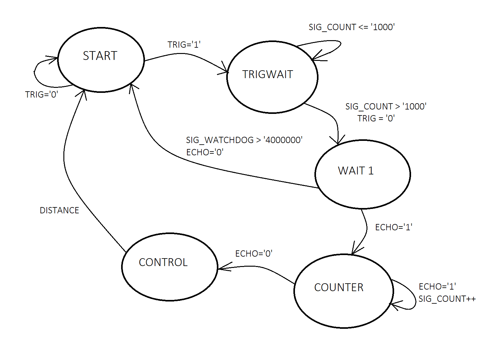

# DE1-Project-Smart-Parking-System-with-Ultrasonic-Sensors
Design and implement a smart parking system using VHDL on the Nexys A7 FPGA board. The system will utilize multiple ultrasonic sensors (HS-SR04) connected to the Pmod connectors for detecting the presence and distance of vehicles within parking spaces. Develop algorithms to analyze sensor data and determine parking space availability. Visualize parking space occupancy status using LEDs, while displaying distance measurements on the 7-segment display.

# Team members
## Oldřich Hána (responsible for ...)
## Jan Chládek (responsible for ...)
## Marek Hlavatovič (responsible for ...)
## Tomáš Čišecký (responsible for ...)
### Theoretical description and explanation

A smart parking system is an automated system designed to optimize the management and control of parking spaces. Its main objective is to improve the efficiency of parking space utilization and provide convenient parking services for drivers. It operates based on sensors placed on parking spaces, which monitor the presence of vehicles and determine their distance from the sensor. These sensors can be ultrasonic sensors like the HS-SR04. 

Smart parking system is beneficial for urban areas, shopping centers, airports, hospitals, and other places with high vehicle traffic.

**Advantages:**
- space utilization optimization
- enhanced convenience
- reduction in traffic issues
- Increased security

**Disadvantages:**
- implementation costs
- maintenance and updates
- technology dependency

In our solution, we implemented the management of the ultrasonic sensor using Moore's finite state machine. We use a 7-segment display to display the distance.

### Hardware description of demo application
Insert descriptive text and schematic(s) of your implementation.
We used these components for the physical implementation:
-  **NEXYS A7 50T Board** -FPGA development platform designed by Digilent. It includes Axtix-7 FPGA which provides a balance of processing power and I/O capabilities. Board contains several built-in peripherals, including an accelerometer, temperature sensor, MEMs digital microphone, a speaker amplifier, and several I/O devices

  
  
-  **HC_SR04 Ultrasonic Sensor** - The HC-SR04 is measuring sensor module that uses sonar to determine distance to an object by sending out a sound pulse and timing how long it takes for the pulse to bounce back after hitting an object.

Since the HC-SR04 is powered from 5V and the NEXYS A7-50T board uses 3.3V, we used a logic level converter for the connection. The use of a logic converter ensures that the FPGA operating at 3.3V communicates safely with the HC-SR04 sensor, which needs 5V. This avoids the risk of damaging the FPGA due to too high a voltage.

### Software description

**START** - initial state of the measurement. By changing the TRIG signal to a value of 1, the transition to the TRIGWAIT state occurs.

**TRIGWAIT** - manage the duration of the trigger pulse that initiates the ultrasonic signal. Signal sig_count determine how long the TRIG pulse has been active. Once the sig_count exceeds 1000, the TRIG signal is set to '0', indicating the end of the ultrasonic pulse. After the TRIG pulse has been correctly terminated, the FSM transitions to the WAIT1 state.

**WAIT1** - detects the ECHO signal, waits for the state to change to '1', which means that the echo signal has been caught. While waiting for ECHO, the sig_watchdog timer is activated, which increments with each clock cycle. This timer helps to identify when the ECHO signal does not arrive at the expected time (ECHO='0'). When the ECHO signal changes to '1', FSM goes into the COUNTER state.

**COUNTER** - measuring the duration of the ECHO. This represents the duration of the ultrasonic signal from sending it to the sensor until it returns. Signal sig_count continues to increment while the ECHO signal is active. It records the total length of the active ECHO signal. When the ECHO signal changes to '0', the measurement process is finished and FSM goes into the CONTROL state.

**CONTROL** - distance calculation based on the time data obtained in the previous state. It ensures that the calculated distance does not exceed the maximum range of the sensor (for example, 0 to 100 units). If the result of the calculation is greater than the maximum range, the distance output will be set to the largest possible value ( 99). After calculating the distance, FSM automatically returns to the initial START state, where the system is ready to start the next measurement cycle.

### Component(s) simulation

**HC-SR04 sensor** - the simulation shows that the sensor did not pick up any ECHO signal,  which could mean too much distance or no obstacle in front of the sensor. Without the arrival of an echo signal, the system remains in the WAIT1  state.

**Controller4Seg** -simulation shows four input values Dist1, Dist2, Dist3 and Dist4 with values of 14, 99, 60 and 11.These values are used to determine what is displayed on each segment of the display.
Sig_count and Vector AN changes at regular intervals, indicating that the display multiplexing is working properly. The AN value changes its state from FE to FB and other combinations during the cycle, corresponding to the activation of different display segments. The sig_dist_out value changes its values depending on the active segment and the corresponding input value.

**LED_PS** -simulation shows how the state of the output vector LED_D changes over time depending on the value of the input signal distance. At the beginning of the simulation, all LEDs are on. This corresponds to the case where if the distance is between 0 and 8, all LEDs are set to '1'.As the distance increases, the LED gradually switches off. These states correspond to the case where, with increasing distance, groups of LEDs are gradually turned off from the bottom of the vector upwards.

### Instructions
Write an instruction manual for your application, including photos and a link to a short app video.

### References
[Nexys A7 manual](https://digilent.com/reference/_media/reference/programmable-logic/nexys-a7/nexys-a7_rm.pdf)

[HC-SR04 User Manual](https://web.eece.maine.edu/~zhu/book/lab/HC-SR04%20User%20Manual.pdf)
